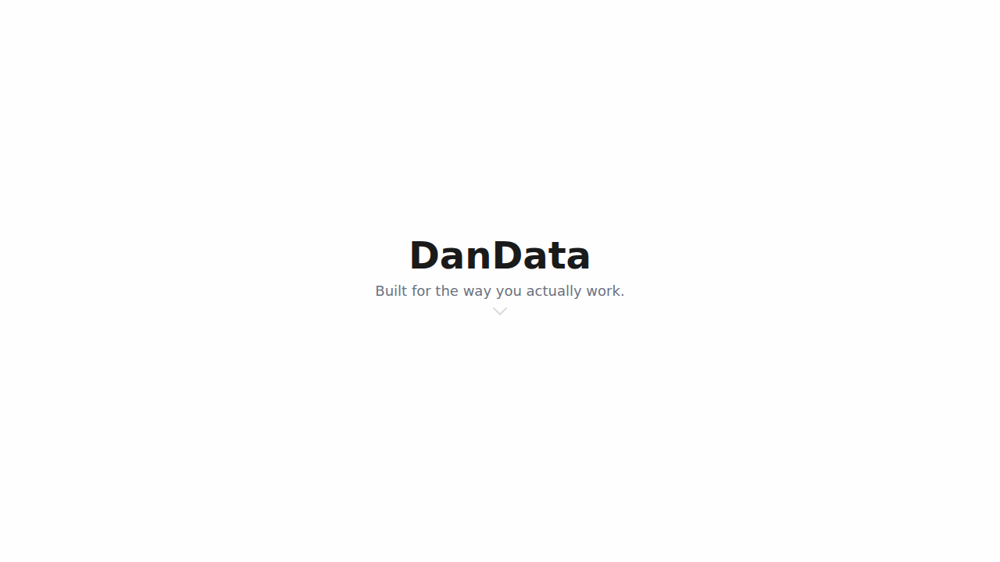
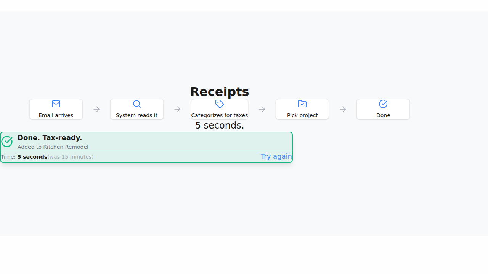
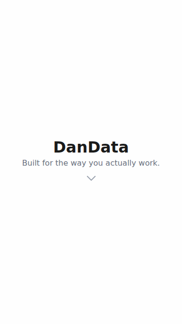
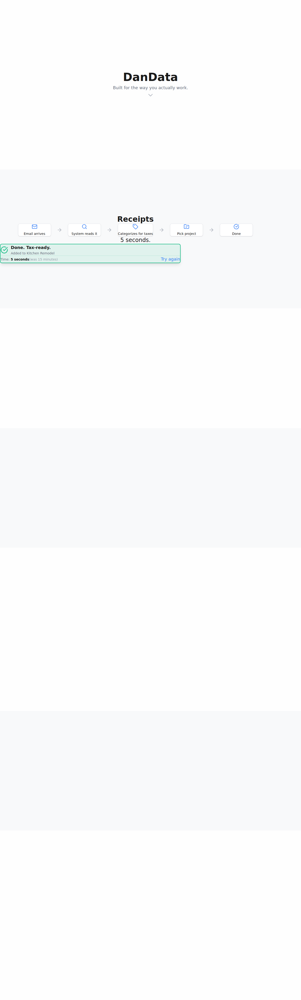

# DanData Showcase

Interactive showcase demonstrating DanData's capabilities - built for contractors who actually work.

## Live Demo

Visit the live site at: https://starlightkristen.github.io/dandata-showcase/

## Overview

A clean, restrained single-page showcase that demonstrates thoughtful workflow design through:

- **Hero** - Simple, confident introduction
- **Receipts** - 5-second receipt processing with interactive demo
- **Change Orders** - Voice-note workflow for client approvals
- **Daily Logs** - 60-second daily documentation
- **Dashboard** - Real-time project tracking with interactive preview
- **Invoicing** - One-click payment collection
- **Closing** - Clear value proposition and call-to-action

## Tech Stack

- **React 18** with TypeScript
- **Vite** for fast builds
- **Tailwind CSS v4** for styling
- **Framer Motion** for smooth animations
- **Lucide React** for icons
- **GitHub Pages** for deployment

## Development

```bash
# Install dependencies
npm install

# Start dev server
npm run dev

# Build for production
npm run build

# Preview production build
npm run preview
```

## Deployment

### Quick Deploy to GitHub Pages

This project is configured for automatic deployment to GitHub Pages via GitHub Actions.

**To Deploy:**
1. Merge PR #3 (`copilot/rebuild-showcase-design` → `main`)
2. GitHub Actions will automatically build and deploy
3. Site will be live at: https://starlightkristen.github.io/dandata-showcase/

**Verify Before Deploy:**
```bash
# Run the verification script
./scripts/verify-deployment.sh

# Or manually:
npm install
npm run build
```

**View Deployment Status:**
- Go to the [Actions tab](https://github.com/starlightkristen/dandata-showcase/actions)
- Look for "Deploy to GitHub Pages" workflow

For detailed deployment instructions, see [DEPLOYMENT.md](DEPLOYMENT.md)


## Design System

The showcase follows a carefully crafted design system with:

- Clean, generous white space
- Calm color palette (soft blues, greens, and grays)
- Inter font family
- Smooth, subtle animations (400ms ease-out)
- Mobile-first responsive design

### Colors

- Primary text: `#1A1A1A`
- Secondary text: `#6B7280`
- Accent blue: `#3B82F6`
- Accent green: `#10B981`
- Accent amber: `#F59E0B`

## Interactive Demos

### Receipt Processing Demo

The most detailed interactive demo shows:
1. Email preview with receipt
2. Automatic item extraction
3. Tax categorization (Schedule C lines)
4. Project selection
5. Completion with time comparison

Users can try the demo multiple times with a "Try again" button.

### Dashboard Preview

Interactive project cards that users can click to focus on different projects:
- Kitchen Remodel (on track, 56% margin)
- Bathroom Addition (watch costs, 20% margin)
- Deck Build (complete, paid in full)

## Mobile Optimization

- Single column layouts on mobile
- Touch-friendly 44px minimum tap targets
- Vertical flow diagrams on small screens
- Optimized font sizes and spacing
- Fast load on 3G networks

## Deployment

The site automatically deploys to GitHub Pages when changes are pushed to the main branch via GitHub Actions workflow.

## Success Criteria

✓ Loads in <2 seconds  
✓ Works perfectly on mobile  
✓ Smooth 60fps animations  
✓ Fully interactive receipt demo  
✓ Clean, accessible code  
✓ Professional polish and restraint  

## Philosophy

Show, don't tell. The thoughtfulness is evident in:
- How frictionless each workflow is
- What's automated vs. what's left in control
- The design choices (60 seconds not 15 minutes, voice notes not typing)
- The polish and restraint

The care is in the design decisions, not the copy.

## Screenshots

### Desktop View


*Clean, confident hero section with generous white space*


*Interactive receipt processing demo showing completion state*

### Mobile View


*Mobile-optimized layout with touch-friendly interface*

### Full Page


*Complete showcase from hero to closing section*
